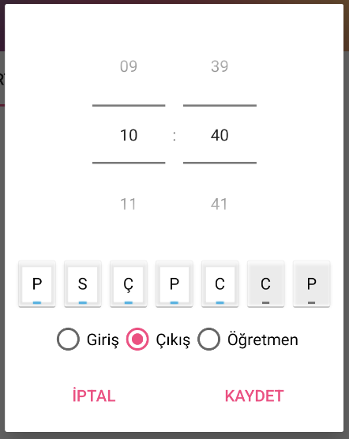
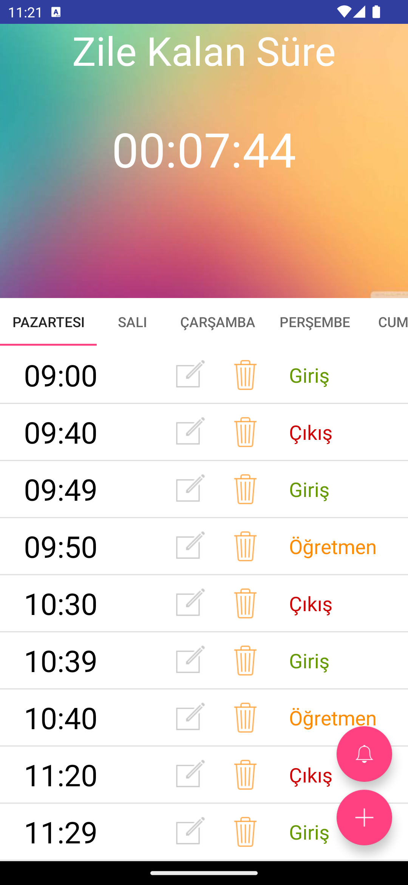
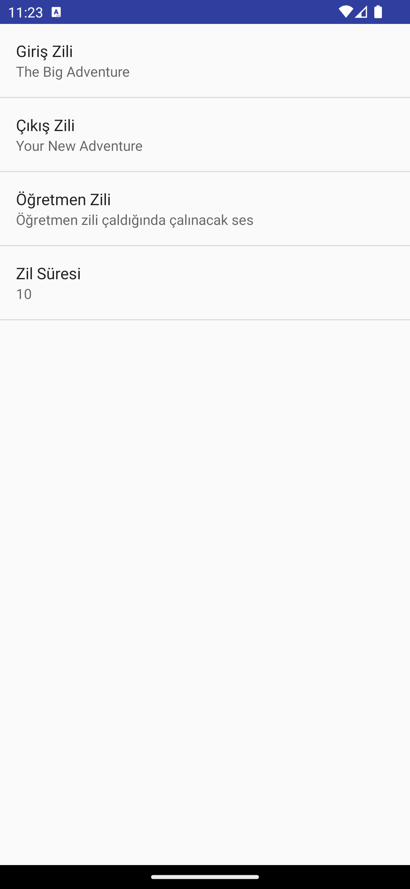

# Okul Zili
Bu Android uygulaması ile okullarda zil sistemi cihazları kullanmak yerine Android işletim sistemine sahip bir telefon veya tablet ile okul zili sistemi kullanılabilir.

Burada dikkat edilmesi gereken husus mobil cihaza, zil hoparlörünün bağlı olduğu amfiyi bağlamaktır.

## Uygulamanın Çalışması
* Uygulamada tüm günler sekme halinde bulunmakta ve her sekmede de o gün için ayarlanan zil türleri bulunmaktadır.
* Zil simgesi butonuna tıklanarak **_Giriş_**, **_Çıkış_** ve **_Öğretmen_** zilleri için ses seçilmelidir.
* Artı (+) butonuna tıklandığında ise aşağıdaki gibi **_Zil Zamanı_**, **_Gün_** ve **_Zil Türü_** seçilebilen bir pencere açılacaktır.

* Bu pencerede ilgili gün, zaman ve zil türü seçildikten sonra kaydetme işlemi yapılmalıdır.
* Kaydetme işlemi sonrası ilgili gün sekmelerinde ayarlanan zil görünecektir.
* Bu sekmelerde seçilen zil istenirse güncellenebilir veya silinebilir.

## Uygulamanın Ekran Görüntüleri

## Licence
    MIT License
    
    Copyright (c) 2023 Necati TUFAN
    
    Permission is hereby granted, free of charge, to any person obtaining a copy
    of this software and associated documentation files (the "Software"), to deal
    in the Software without restriction, including without limitation the rights
    to use, copy, modify, merge, publish, distribute, sublicense, and/or sell
    copies of the Software, and to permit persons to whom the Software is
    furnished to do so, subject to the following conditions:
    
    The above copyright notice and this permission notice shall be included in all
    copies or substantial portions of the Software.
    
    THE SOFTWARE IS PROVIDED "AS IS", WITHOUT WARRANTY OF ANY KIND, EXPRESS OR
    IMPLIED, INCLUDING BUT NOT LIMITED TO THE WARRANTIES OF MERCHANTABILITY,
    FITNESS FOR A PARTICULAR PURPOSE AND NONINFRINGEMENT. IN NO EVENT SHALL THE
    AUTHORS OR COPYRIGHT HOLDERS BE LIABLE FOR ANY CLAIM, DAMAGES OR OTHER
    LIABILITY, WHETHER IN AN ACTION OF CONTRACT, TORT OR OTHERWISE, ARISING FROM,
    OUT OF OR IN CONNECTION WITH THE SOFTWARE OR THE USE OR OTHER DEALINGS IN THE
    SOFTWARE.